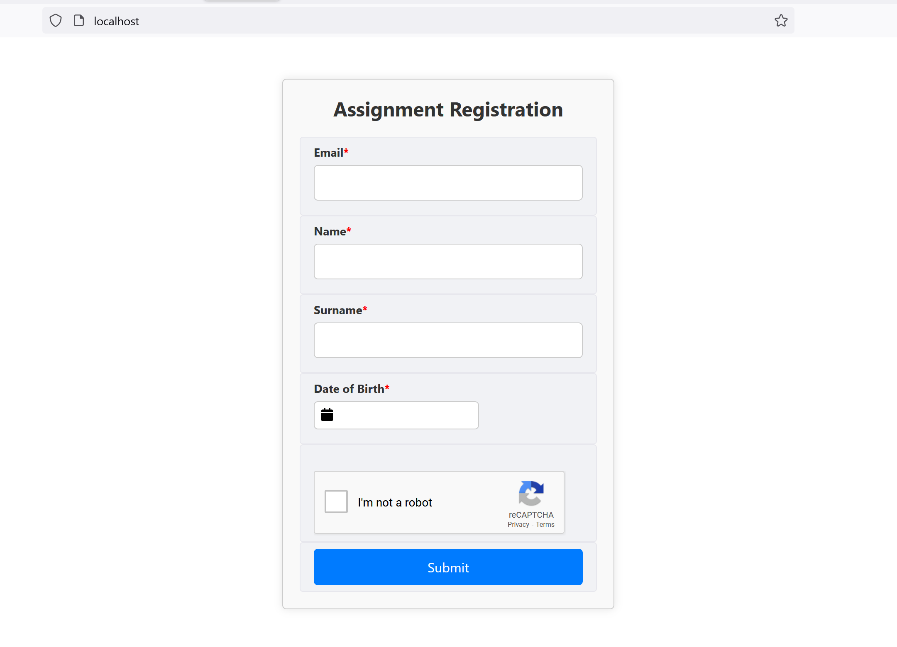
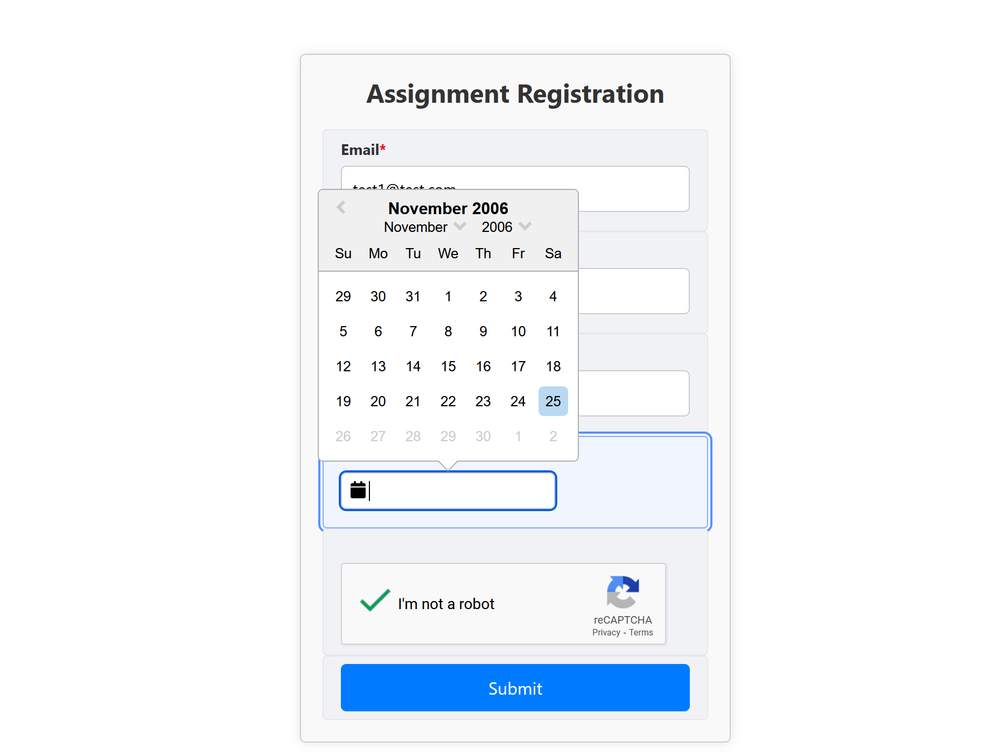
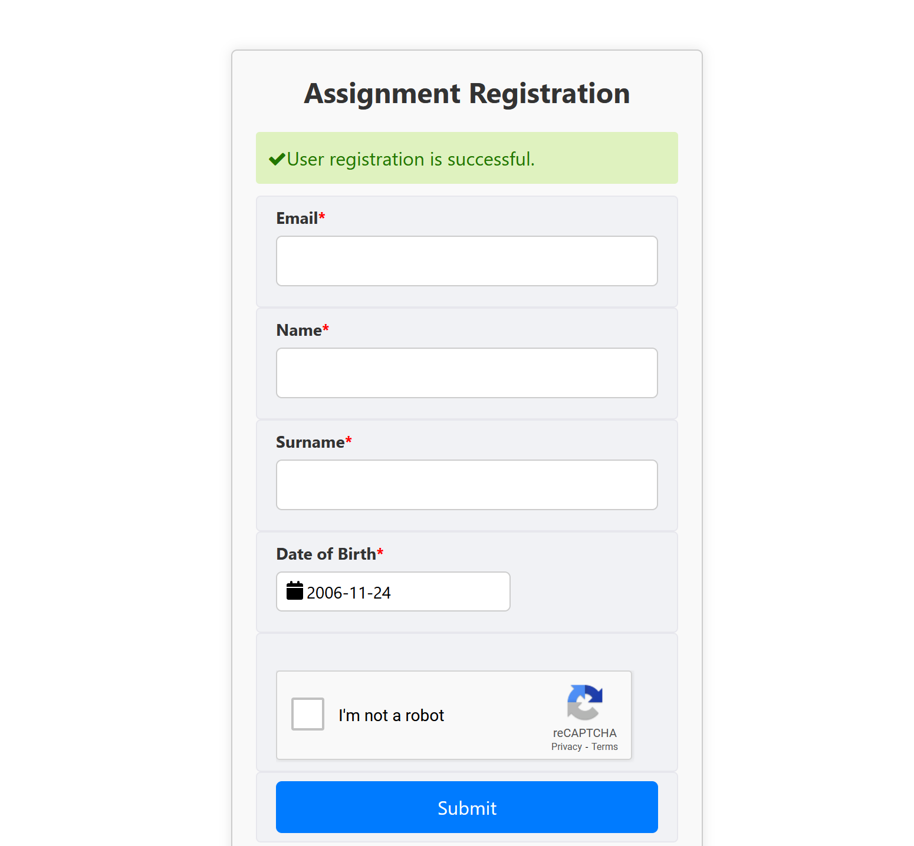

## Project Title

Registration 

Table of Content:

    About The App
    Screenshots
    Technologies
    Setup
    Approach
    

## About The App
The app is used to register users info:
●	Name
●	Surname
●	Date of birth
●	Email
●	Captcha
This information will be stored (in a database persistently). Additionally, the date on which the registration was made will be included. 

Screenshots




## Technologies

 Vite, ReactJS, Node JS, express, MongoDB, and Docker
## Setup

    download or clone the repository
    Add .env to both api and liferay-ui 
api .env
```
REACT_APP_SITE_KEY={REACT_GOOGLE_SITE_SECERT}
SITE_SECRET={GOOGLE_SITE_SECERT}
token={YOUR_API_KEY}
```
liferay-ui .env
```
VITE_REACT_APP_SITE_KEY={MY_APP_REACT_SITE}
VITE_SITE_SECRET={MY_APP_SITE_SECRET}
VITE_USER_API_TOKEN={MY_APP_API_KEY}
VITE_USER_API_BASE_URL={MY_APP_API_URL}
```
run npm install
...

## Approach

I adopted the BEM naming style for my css class names and ...

## Run Docker
Install
1- Add .env file in root of repo with below content
REACT_APP_SITE_KEY={CATCHA_SITE_KEY}
SITE_SECRET={captcha}
token={API_KEY}
2- Run "docker compose up -d"

Validate API:
List all users
curl --location 'localhost:8080/api/v1/users' \
--header 'x-api-key: {API_KEY}' \
--header 'Cookie: _csrf=8pKX1-xFJZjdhW_AhQGj6gT9'
Add User:
curl --location 'localhost:8080/api/v1/users' \
--header 'x-api-key: {API_KEY}' \
--header 'Content-Type: application/json' \
--header 'Cookie: _csrf=8pKX1-xFJZjdhW_AhQGj6gT9' \
--data-raw '{
    "name": "Asmaa",
    "surname":"Mah",
    "email":"testg@test.com",
    "dob":"1982-08-27"
}'
Run React App
http://localhost
